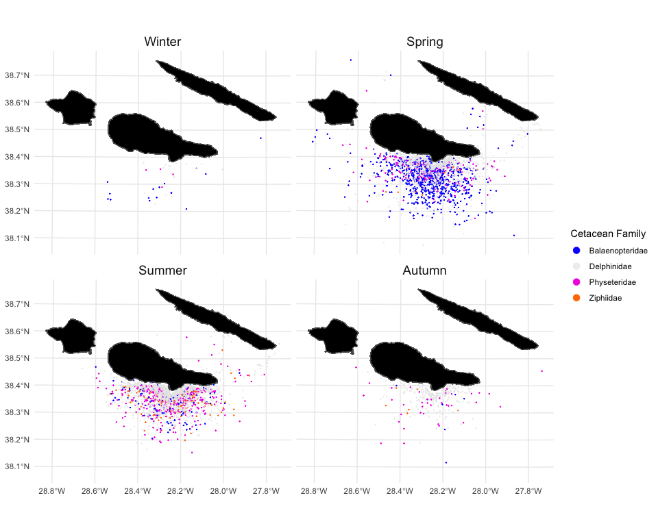

<!-- README.md is generated from README.Rmd. Please edit that file -->

# azores.bkw

<!-- badges: start -->

<!-- badges: end -->

The goal of `{azores.bkw}` is to provide an R Compendium Accompanying for Peres dos Santos, R., Sears, R., Magno, R. and Castilho, R. _Ecology and Seasonal Habitat Use of Northern Bottlenose
and Sowerby's Beaked Whales in the Azores_. Marine Mammal Science 32:2, 42:e70172 (2026).
DOI: [10.1111/mms.70172](https://doi.org/10.1111/mms.70172).

## Installation

``` r
# install.packages("pak")
pak::pak("patterninstitute/azores.bkw")
```

## Sightings

A data set of sightings of beaked whales in the Azores, during the
period of 2012 and 2018:

``` r
library(azores.bkw)
library(ggplot2)
library(dplyr)
library(CAOP.RAA.2024)
library(azores.rorquals)

bkw.sightings
#> # A tibble: 185 × 11
#>    sighting_id latitude longitude date       initial_time       
#>          <int>    <dbl>     <dbl> <date>     <dttm>             
#>  1          48     38.3     -28.4 2016-04-16 2016-04-16 11:34:32
#>  2          49     38.4     -28.3 2016-04-17 2016-04-17 11:39:17
#>  3           3     38.3     -28.2 2014-04-15 2014-04-15 12:25:22
#>  4           2     38.4     -28.5 2013-04-23 2013-04-23 18:11:09
#>  5           3     38.3     -28.3 2013-04-30 2013-04-30 12:12:04
#>  6           8     38.4     -28.4 2016-04-07 2016-04-07 18:32:12
#>  7           1     38.3     -28.2 2012-05-24 2012-05-24 10:21:43
#>  8           8     38.3     -28.3 2015-05-24 2015-05-24 16:55:03
#>  9          11     38.4     -28.2 2016-05-13 2016-05-13 13:02:33
#> 10           1     38.4     -28.0 2012-05-06 2012-05-06 16:42:30
#> # ℹ 175 more rows
#> # ℹ 6 more variables: final_time <dttm>, other_species <chr>, species <chr>,
#> #   duration <drtn>, season <chr>, family <chr>
```

## Beaked whales occurrences

The `bkw_occurrence` dataset is derived from `presences_sf2` from
package `azores.rorquals` through the following steps:

1.  Only observations from the `rps` dataset was keeped

2.  Observations with missing (`NA`) values for any climate or
    topographical variable are removed.

3.  Observations of the target species—Sowerby’s beaked whale
    (*Mesoplodon bidens*), True’s beaked whale *Mesoplodon mirus*,
    Blanville’s beaked whale (*Mesoplodon densirostris*), Gervais’s
    beaked whale (*Mesoplodon europaeus*), Northern bottlenose whales
    (*Hyperoodon ampullatus*), and Cuvier’s beaked whale (*Ziphius
    cavirostris*)—are classified as “presence” in the class column,
    while all other species are labeled as “absence”.

4.  Observations that could simultaneously represent both presences of
    target species and absences of others are excluded.

5.  Observations located on land are removed. This issue may arise due
    to rasterization effects in climate and topographical data, when
    merging locations that are very close to the shore (\< 500 m).

``` r
bkw_occurrence
#> Simple feature collection with 5044 features and 16 fields
#> Geometry type: POINT
#> Dimension:     XY
#> Bounding box:  xmin: -70838.13 ymin: -47128.94 xmax: 23018.38 ymax: 28774.46
#> Projected CRS: +proj=laea +lat_0=38.5 +lon_0=-28 +datum=WGS84 +units=m +no_defs
#> # A tibble: 5,044 × 17
#>    source species         class datetime            date       time     sc    tc
#>    <chr>  <chr>           <chr> <dttm>              <date>     <hms> <int> <int>
#>  1 rps    Balaenoptera p… abse… 2012-03-28 12:22:34 2012-03-28 4455…     2     2
#>  2 rps    Tursiops trunc… abse… 2012-03-28 13:01:29 2012-03-28 4688…     1     1
#>  3 rps    Delphinus delp… abse… 2012-03-28 13:57:05 2012-03-28 5022…     2     2
#>  4 rps    Balaenoptera m… abse… 2012-03-29 10:17:56 2012-03-29 3707…     2     1
#>  5 rps    Balaenoptera m… abse… 2012-03-29 11:43:25 2012-03-29 4220…     3     1
#>  6 rps    Balaenoptera p… abse… 2012-03-29 10:17:56 2012-03-29 3707…     1     1
#>  7 rps    Delphinus delp… abse… 2012-03-29 12:12:58 2012-03-29 4397…     2     2
#>  8 rps    Balaenoptera m… abse… 2012-03-30 10:11:15 2012-03-30 3667…     1     1
#>  9 rps    Balaenoptera p… abse… 2012-03-30 11:32:39 2012-03-30 4155…     2     1
#> 10 rps    Delphinus delp… abse… 2012-03-30 10:15:55 2012-03-30 3695…     1     1
#> # ℹ 5,034 more rows
#> # ℹ 9 more variables: presence <chr>, mixed_sp_grp <chr>, geometry <POINT [m]>,
#> #   sst <dbl>, hmlmeso <dbl>, lmeso <dbl>, mlmeso <dbl>, depth <dbl>,
#> #   slope <dbl>

colours <- c(
  Balaenopteridae = "#0F00FF",
  Physeteridae = "#F404E2",
  Ziphiidae = "#FF7A00",
  Delphinidae  = "#E8E8E8AF",
  Kogiidae = "#00E000",
  Balaenidae = "#FFEE00AF",
  Phocoenidae = "#04B3F4"
)

islands_triangle <- CAOP.RAA.2024::districts() |>
  dplyr::filter(district %in% c("Ilha de São Jorge",
                         "Ilha do Pico",
                         "Ilha do Faial"))

bkw_occurrence |>
  dplyr::mutate(season = azores.rorquals::as_season(date)) |>
  dplyr::left_join(cetaceans(), by = "species") |>
  tidyr::drop_na(family) |>
  ggplot() +
  geom_sf(data = islands_triangle, fill = "black") +
  geom_sf(mapping = aes(col = family), size = 0.1) +
  scale_color_manual(values = colours, name = "Cetacean Family") +
  guides(colour = guide_legend(override.aes = list(size = 3))) +
  facet_wrap(vars(season)) +
  theme_minimal() +
  theme(legend.title = element_text(hjust = 0.5),
        strip.text = element_text(size = 14))
```


